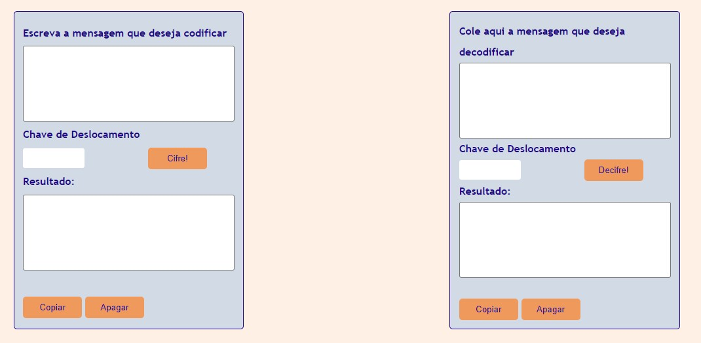

# Cifra de César

## Índice

- [1. Sobre](#1-Sobre)
- [2. Interface](#2-Interface)
- [3. Como usar](#3-como-usar)
- [4. Tecnologias Utilizadas](#4-tecnologias-utilizadas)

## 1. 👓 Sobre

 A cifra de César é um dos primeiros tipos de criptografias conhecidas na história. É um tipo de cifra por substituição, em que cada letra do texto original é substituida por outra que se encontra há um número fixo de posições (deslocamento) mais a frente do mesmo alfabeto.

Por exemplo estabelecemos um deslocamento de 3 posições, á direita no alfabeto, a letra A seria substituída pela D, que está 3 posições a sua frente e assim sucessivamente para as demais letras do alfabeto.

## 2. 🖥️ Interface

## 3. 🛠️ Como usar

1. Através do alfabeto simples (somente maiúsculas e sem ç), o usuário pode escrever uma mensagem para ser criptografada;

2. Após escrever a mensagem, o usuário deve determinar o número da chave de deslocamento da Cifra. Para decodificar a mensagem, <b> o número da chave de deslocamento precisa ser igual ao número que foi utilizado na chave para criptografar a mensagem anteriormente.</b>;

3. Para criptografar ou decriptografar, basta clicar no botão 'Cifre!' ou então 'Decifre!' respectivamente.

## ⚙️ Tecnologias utilizadas
*   HTML5
*   Vanilla JavaScript
*   CSS

