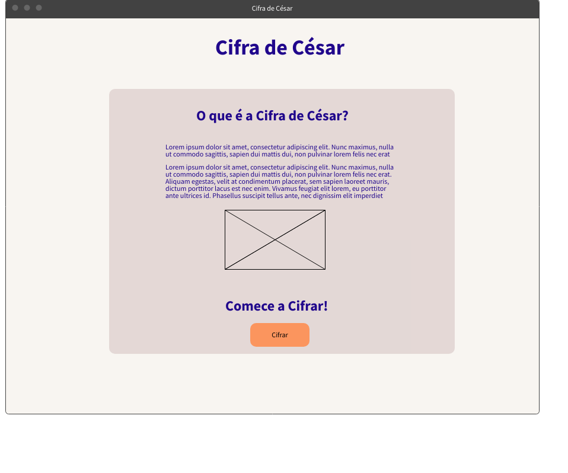
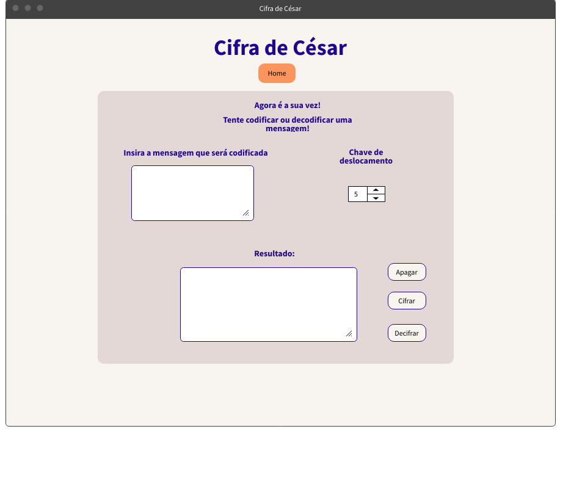

# Cifra de César

## Índice

- [1. Sobre](#1-Sobre)
- [2. Resumo do projeto e relação com o usuário](#2-resumo-do-projeto)
- [3. Interface do Usuário](#3-interface-do-usuário)
- [4. Funcionalidades](#4-funcionalidades)
- [5. Instalação](#5-instalacao)

---

## 1. Sobre

 A cifra de César é um dos primeiros tipos de criptografias conhecidas na história. É um tipo de cifra por substituição, em que cada letra do texto original é substituida por outra que se encontra há um número fixo de posições (deslocamento) mais a frente do mesmo alfabeto.

Por exemplo se usarmos o deslocamento (_offset_) de 3 posições:

- Alfabeto sem cifrar: A B C D E F G H I J K L M N O P Q R S T U V W X Y Z
- Alfabeto com cifra: D E F G H I J K L M N O P Q R S T U V W X Y Z A B C
- A letra A será D
- A palavra CASA será FDVD

## 2. Resumo do projeto e relação com o usuário

O projeto parte da ideia de uma aplicação web na qual o usuário poderá escrever mensagens e cifrar/decifrar tais mensagens utilizando funcionalidades em uma interface interativa. Não existe um tema específico: o público-alvo desta aplicação seria qualquer usuário que tenha interesse e/ou busque por temas afins como 'criptografia', 'cifras', 'codificação de mensagens' etc.

Ao se deparar com a aplicação, o usuário encontraria um pequeno texto informativo sobre o funcionamento da cifra e uma interface que o permitirar testar o funcionamento da mesma. Nessa interface, o usuário encontraria:

 - Um campo destinado para que o usuário escolha o offset (chave de deslocamento) .
 - Um campo destinado para que o usuário escreva uma mensagem que será cifrada ou decifrada.
 - Um campo destinado para mostrar o resultado da mensagem cifrada / mensagem decifrada.

Através dessa aplicação, o usuário poderia utiliza-la para codificar mensagens para os mais diversos fins e compartilha-las casualmente em qualquer plataforma de troca de mensagens, bastando apenas que o usuário compartilhe o aplicativo web juntamente com a mensagem cifrada  e o número de deslocamento.

## 3. Interface do Usuário

A princípio, a aplicação possuiria duas interfaces: a primeira seria uma tela de boas vindas com um texto informativo e uma imagem contextualizando sobre o que se trata a Cifra de César. No final da página, o usuário encontraria um menu de navegação, que o convidava a testar a cifra. Haveria um botão que o levaria a outra página na qual estaria um formulário onde ele poderia submeter uma mensagem e cifra-la /decifra-la.

Todavia, a medida que o projeto foi sendo desenvolvido, o número de páginas foi reduzido para apenas uma única página, mas mantendo a mesma estrutura: um texto com uma imagem explicando sobre o que era a cifra e logo abaixo, um formulário com botões que permitiam o usuário escrever e criptografar uma mensagem.

## 4. Funcionalidades

- Através do alfabeto simples (somente maiúsculas e sem ç), o usuário pode escrever uma mensagem para ser criptografada;

- Próximo à interface onde o usuário escreverá a mensagem que quer criptografar, há um input no qual é possível determinar o nº de deslocamento da cifra;

- Após escrever a mensagem e escolher o nº de deslocamento, o usuário pode clicar no botão 'Cifre!' ou 'Decifre!' para aplicar a codificação/ decodificação respectivamente.

## 5. Instalação

Este projeto está disponível para utilização e visualização online através do seguinte endereço web (URL):

https://loulima.github.io/SAP007-cipher/

É possível acessar este endereço web (URL) através de um navegador. Nele, o usuário poderá utilizar todas as funcionalidades disponíveis da aplicação.

